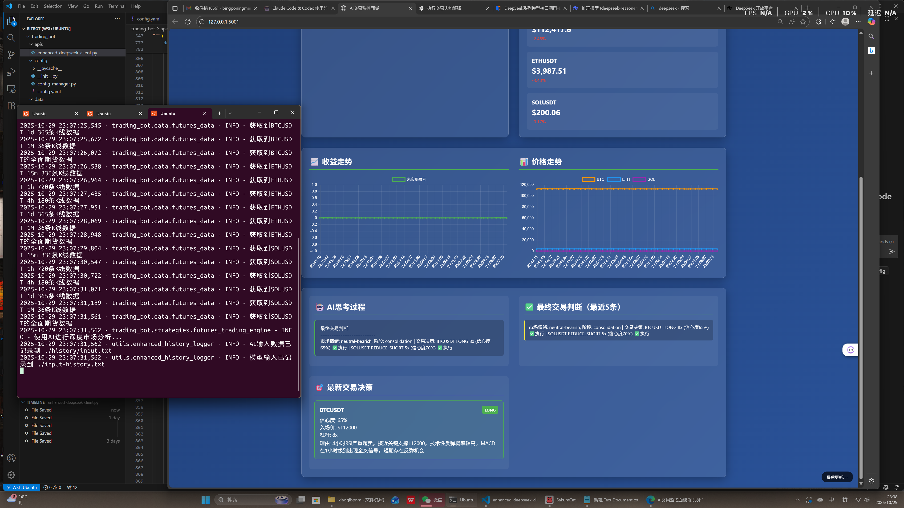
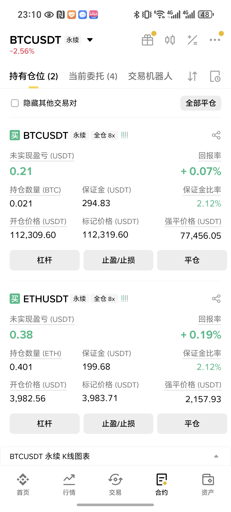

# 期货交易机器人 | Futures Trading Bot

一个专业的加密货币期货交易机器人，集成了 Binance Futures API 和 DeepSeek AI，支持多时间周期分析和智能交易决策。


## 🚀 项目特色

### 核心功能
- **期货交易专精**: 专为 Binance U本位合约设计
- **AI驱动决策**: 集成 DeepSeek AI 进行智能市场分析
- **多时间周期分析**: 支持从1分钟到周线的全方位技术分析
- **风险管理系统**: 内置多层风险控制和安全验证
- **实时数据处理**: 高效的异步数据获取和处理架构

### 技术亮点
- **异步架构**: 全异步设计，支持高并发数据处理
- **多策略支持**: 保守、激进、趋势跟踪等多种交易策略
- **智能杠杆管理**: 基于市场条件和风险评估的动态杠杆调整
- **历史记录系统**: 完整的交易决策和AI分析历史追踪
- **测试网支持**: 安全的模拟交易环境
 - **稳定性增强**: 支持指数退避重试与告警（alarm.txt + Web告警）
 - **更安全的平/减仓**: 自动 reduce-only 平仓，避免触发最小名义价值限制与误加仓

## 📋 快速开始

### 环境要求
- Python 3.8+
- 网络连接（访问 Binance API 和 DeepSeek API）

### 安装依赖
```bash
# 克隆项目
git clone <项目地址>
cd bitbot

# 安装依赖
pip install -r requirements.txt
```

### 配置设置
1. 复制配置文件并修改API密钥：
```bash
cp trading_bot/config/config.yaml trading_bot/config/config_custom.yaml
```

2. 在 `config_custom.yaml` 中配置您的API密钥：
```yaml
apis:
  binance:
    api_key: "您的Binance API密钥"
    api_secret: "您的Binance API密钥密码"
    testnet: true  # 建议先使用测试网
  deepseek:
    api_key: "您的DeepSeek API密钥"
```

### 运行示例

#### 🤖 自动交易模式（15分钟智能分析）

所有命令都将启动**自动交易模式**，每15分钟进行一次智能市场分析：

```bash
# 仅分析模式（推荐先测试）
python main.py --strategy aggressive

# 保守策略自动分析
python main.py --strategy conservative

# 趋势跟踪策略自动分析
python main.py --strategy trend_following
```

#### ⚡ 实际交易执行（谨慎使用）

**⚠️ 重要：在执行任何真实交易前，请务必先阅读 [`REAL_TRADING_GUIDE.md`](REAL_TRADING_GUIDE.md) 完整指南！**

```bash
# 🧪 测试网真实交易（安全，推荐先使用）
# 需要先配置testnet: true和real_trading_enabled: true
python main.py --strategy aggressive --execute

# 🔥 主网真实交易（极度谨慎，使用真实资金）
# 需要先配置testnet: false和real_trading_enabled: true
python main.py --strategy conservative --execute  # 建议先用保守策略
```

## 🔴 真实交易快速配置

### 📋 配置检查清单

启用真实交易需要修改 `trading_bot/config/config.yaml`：

```yaml
# 第一步：选择环境
apis:
  binance:
    testnet: true   # 测试网: true, 主网: false

# 第二步：启用真实交易
trading:
  mode:
    dry_run: false  # 必须设为false

  safety:
    real_trading_enabled: true  # 启用真实交易

  order_settings:
    default_order_type: "MARKET"  # 或 "LIMIT"
```

### ⚡ 快速开始

1. **测试网交易**（推荐）：
   ```bash
   # 修改config.yaml: testnet: true, real_trading_enabled: true
   python main.py --strategy aggressive --execute
   ```

2. **主网交易**（谨慎）：
   ```bash
   # 修改config.yaml: testnet: false, real_trading_enabled: true
   python main.py --strategy conservative --execute
   ```

**📖 详细配置**: 完整配置说明请查看 [`REAL_TRADING_GUIDE.md`](REAL_TRADING_GUIDE.md)

### 🤖 AI智能决策功能

**AI现在可以决策的参数（已扩展）**：
- ✅ 交易动作：`long/short/add_to_long/add_to_short/reduce_long/reduce_short/close_long/close_short/adjust_tp_sl/cancel_tp_sl`
- ✅ 资金金额：使用 `usdt_amount`（真实USDT投入）；不使用 `position_size`
- ✅ 订单类型：MARKET / LIMIT（LIMIT 必须给出 `entry_price`）
- ✅ 止损止盈：`stop_loss`、`take_profit`（单一数值）
- ✅ 减/平仓幅度：`reduce_percent` / `reduce_usdt` / `close_percent`
- ✅ 杠杆倍数（1x-10x）
- ✅ 仓位大小（百分比）
- ✅ **订单类型（MARKET/LIMIT）** - 🆕新增！
- ✅ 止损止盈价格
- ✅ 是否执行交易

**AI订单类型与风控**：
- **MARKET订单**：趋势明确、需要快速进出场时
- **LIMIT订单**：市场波动大、希望精确控制价格时
- **备用机制**：如果AI未指定，使用配置文件默认值
- **reduce-only 平/减仓**：系统自动设置，确保只减少现有持仓，不会误加仓

限价单超时策略：
- 默认仅等待 12 分钟（`trading.order_settings.limit_order.max_wait_time: 720`）
- 超时未成交则取消订单并记录失败，不会自动回退为市价单

#### 🎯 功能特性
- **会话跟踪**: 自动记录运行时长和AI调用次数
- **智能上下文**: AI了解当前会话状态和历史调用
- **思考记录**: AI推理过程自动保存到 `history/think.txt`
- **15分钟周期**: 专门优化的交易分析频率
- **历史记录**: 完整的输入输出数据记录
 - **告警与重试**: API失败会自动重试（指数退避），最终失败写入 `alarm.txt` 并在Web面板顶部展示
 - **最小名义价值保护**: 非 reduce-only 订单自动提升至不少于配置的 USDT 名义价值（默认 5 USDT）


#### 测试功能
```bash
# 测试期货数据获取
python test_futures_klines.py

# 运行pytest测试（python-binance库测试）
pytest python-binance-master/python-binance-master/tests/ -v
```

## 🏗️ 系统架构

### 数据流处理架构

```
原始市场数据 → 数据预处理 → 技术指标计算 → AI分析 → 交易决策 → 风险验证 → 执行交易
     ↓              ↓              ↓           ↓         ↓          ↓           ↓
Binance API → FuturesDataManager → 多时间周期K线 → 技术指标计算 → 提示工程 → DeepSeek AI → 结构化输出
```

### 核心组件

#### 1. 数据获取层 (`trading_bot/data/futures_data.py`)
- **FuturesDataManager**: 核心数据管理器
- **功能**: 多时间周期K线、账户信息、持仓、资金费率、订单簿深度
- **支持的时间周期**: 1m, 5m, 15m, 1h, 4h, 1d, 1w
- **技术指标**: RSI, MACD, 布林带, ATR, 移动平均线, 波动率

#### 2. AI分析层 (`trading_bot/apis/enhanced_deepseek_client.py`)
- **EnhancedDeepSeekClient**: 增强版DeepSeek客户端
- **功能**: 市场数据分析、情绪分析、交易建议生成
- **特色**: 多时间周期综合分析、期货特有指标处理

#### 3. 交易执行层 (`trading_bot/strategies/futures_trading_engine.py`)
- **FuturesTradingEngine**: 期货交易引擎
- **功能**: 策略执行、仓位管理、订单下达
- **特色**: 杠杆管理、风险控制、实时监控

#### 4. 风险管理层 (`trading_bot/utils/risk_manager.py`)
- **RiskManager**: 风险管理器
- **功能**: 仓位限制、损失控制、安全验证
- **特色**: 多层风险检查、动态风险调整

#### 5. 历史记录层 (`trading_bot/utils/enhanced_history_logger.py`)
- **EnhancedHistoryLogger**: 增强版历史记录器
- **功能**: 完整的交易历史、AI输入输出记录
- **输出文件**: `history.txt`, `input-history.txt`, `history/input.txt`, `history/output.txt`, 分析结果JSON

## 📊 数据处理流程

### 1. 原始数据获取
从 Binance Futures API 获取：
- **K线数据**: OHLCV + 交易量数据
- **账户信息**: 余额、保证金、持仓
- **市场数据**: 24小时统计、资金费率、持仓量
- **订单簿**: 买卖盘深度数据

### 2. 技术指标计算
对K线数据计算50+项技术指标：
- **趋势指标**: SMA, EMA, MACD
- **强度指标**: RSI, ATR
- **波动率指标**: 布林带, 历史波动率
- **成交量指标**: 成交量比率, 资金流向
- **支撑阻力**: 高低点分析, 关键价位

### 3. 数据格式化与验证
- **数据清洗**: 处理异常值和缺失数据
- **格式统一**: 标准化时间戳和数值格式
- **完整性检查**: 确保数据完整性和一致性

### 4. AI输入准备
将处理后的数据按以下结构组织：
- **市场概览**: 价格、涨跌幅、成交量
- **多时间周期分析**: 各时间周期的技术指标
- **期货特有数据**: 资金费率、持仓量、订单簿
- **历史趋势**: 价格历史和波动率分析

## 🤖 AI分析系统

### Prompt优化策略
详细的提示词工程策略请参考 [`prompt-optimization.txt`](prompt-optimization.txt) 文件。

### AI输出处理
- **结构化响应**: JSON格式的分析结果
- **多维度分析**: 市场概览、时间周期分析、交易建议
- **风险评估**: 详细的风险警告和建议
- **置信度评分**: 每个建议都包含置信度评分

## ⚙️ 配置说明

### 交易策略配置
```yaml
strategy_prompts:
  conservative:  # 保守策略 - 低杠杆，严格止损
  aggressive:    # 激进策略 - 中高杠杆，积极捕捉机会
  trend_following: # 趋势跟踪 - 跟随主要趋势
```

### 风险管理配置
```yaml
risk_management:
  max_daily_loss: 0.05      # 最大日损失 5%
  max_position_per_symbol: 1 
  max_total_exposure: 0.8   # 最大总敞口 80%
  max_trades_per_hour: 10   # 每小时最大交易次数
```

### 期货交易配置
```yaml
trading:
  futures:
    default_leverage: 3     # 默认杠杆倍数
    max_leverage: 10        # 最大杠杆倍数
    margin_type: "CROSSED"  # 保证金模式
  order_settings:
    default_order_type: "MARKET"
    min_notional_usdt: 5.0  # 非 reduce-only 订单的名义价值下限（默认5 USDT）
    limit_order:
      max_wait_time: 720    # 限价单等待超时时间（秒），默认12分钟，超时只取消不回退
  safety:
    real_trading_enabled: true  # 实盘开关（请先在testnet验证）
```

### 止盈止损管理（TP/SL）
- 开仓成功后自动根据 AI 建议设置止损（STOP_MARKET）和主要止盈（TAKE_PROFIT_MARKET）。
- `adjust_tp_sl`：取消旧TP/SL并按新价格重设。
- `cancel_tp_sl`：仅取消TP/SL。

## 📁 项目结构

```
bitbot/
├── main.py                     # 主程序入口
├── requirements.txt            # 依赖列表
├── test_futures_klines.py     # 期货功能测试
├── CLAUDE.md                  # Claude Code 指导文档
├── README.md                  # 项目说明
├── prompt-optimization.txt    # 提示词优化详解
├── trading_bot/
│   ├── __init__.py
│   ├── config/
│   │   └── config.yaml        # 主配置文件
│   ├── data/
│   │   ├── __init__.py
│   │   └── futures_data.py    # 期货数据管理
│   ├── apis/
│   │   ├── __init__.py
│   │   └── enhanced_deepseek_client.py  # AI客户端
│   ├── strategies/
│   │   ├── __init__.py
│   │   └── futures_trading_engine.py    # 交易引擎
│   └── utils/
│       ├── __init__.py
│       ├── risk_manager.py     # 风险管理
│       └── enhanced_history_logger.py   # 历史记录
├── python-binance-master/      # Binance API库
├── logs/                       # 日志文件
├── data/                       # 分析结果存储
├── history/                    # 🆕 AI数据记录目录
│   ├── input.txt              # 🆕 AI完整输入数据
│   └── output.txt             # 🆕 AI完整输出数据
├── alarm.txt                  # 🆕 关键失败报警（指数重试仍失败时写入）
├── history.txt                 # 交易历史
└── input-history.txt           # AI输入历史
```

## 🔧 开发指南

### 添加新的交易策略
1. 在 `config.yaml` 中添加策略提示词
2. 修改 `FuturesTradingEngine` 以支持新策略
3. 更新风险管理参数
4. 添加相应的测试用例

### 添加新的技术指标
1. 在 `FuturesDataManager.calculate_advanced_indicators()` 中添加计算逻辑
2. 更新 `EnhancedDeepSeekClient` 的数据格式化方法
3. 修改AI提示词以包含新指标

### 扩展AI分析能力
1. 优化 `_build_enhanced_system_prompt()` 系统提示词
2. 增强 `_build_comprehensive_analysis_prompt()` 分析提示词
3. 完善 `_parse_enhanced_analysis_response()` 响应解析
 4. 确保动作/字段同步：支持 `usdt_amount`、新动作（close/reduce/adjust/cancel）与 reduce-only 语义

## ⚠️ 安全须知

### 测试网使用
- **强烈建议**先在测试网环境下验证所有功能
- 测试网配置: `testnet: true`
- 测试网API密钥可在 Binance 测试网站获取

### API密钥安全
- 绝不在代码中硬编码API密钥
- 使用独立的配置文件管理密钥
- 定期更换API密钥
- 限制API密钥权限（仅期货交易）

### 风险管理
- 设置合理的止损点，并尽量以“风险百分比 × 账户权益 ÷ 止损距离”反推 `usdt_amount`
- 控制单次交易风险与总敞口，避免相关性过高的同时持仓
- 利用 `min_notional_usdt` 避免小额下单失败；平/减仓务必 reduce-only（系统已自动设置）
- 定期检查系统运行状态与 `alarm.txt`，及时处置连续失败

## 📈 性能优化

### 数据处理优化
- 使用异步I/O提高并发性能
- 实现数据缓存减少API调用
- 优化技术指标计算算法

### AI分析优化
- 精简提示词长度
- 优化数据格式化
- 实现分析结果缓存

## 🐛 故障排除

### 常见问题
1. **API连接失败**: 检查网络连接和API密钥（网络抖动时系统会重试）
2. **数据获取异常**: 验证币种符号和时间周期
3. **AI分析错误**: 检查DeepSeek API额度和网络
4. **交易执行失败**: 确认账户余额和权限设置；检查是否触发名义价值限制（-4164），非 reduce-only 订单需要≥5 USDT 名义价值

### 日志分析
- 主日志: `logs/futures_bot.log`
- 交易历史: `history.txt`
- AI输入历史: `input-history.txt`
- 🆕 AI完整输入: `history/input.txt`
- 🆕 AI完整输出: `history/output.txt`
- 🆕 告警文件: `alarm.txt`
- 分析结果: `data/futures_analysis_*.json`

## 📞 技术支持

### 文档资源
- [Binance Futures API 文档](https://binance-docs.github.io/apidocs/futures/en/)
- [DeepSeek API 文档](https://platform.deepseek.com/docs)
- [项目提示词优化指南](prompt-optimization.txt)
 - [Reduce-Only 说明（社区）](https://dev.binance.vision/t/reduceonly-parameter/)

### 贡献指南
欢迎提交Issue和Pull Request来改进项目。

## 📄 许可证

本项目仅供学习和研究使用。请遵守相关法律法规，风险自负。

---

**⚠️ 风险提示**: 加密货币交易存在极高风险，可能导致资金损失。请谨慎使用，充分了解风险后再进行实盘交易。
